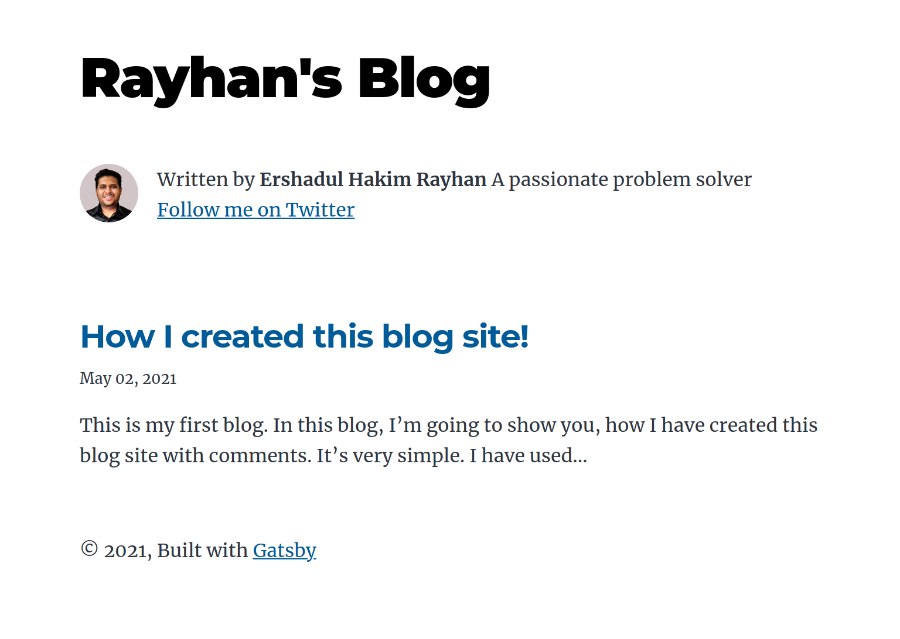

# My Blog
A blog site where I will write my blog articles.

## Project Description

A blog site built using gatsby. The blog articles can be written using markdown language. Users can create comments. I'm using utterances for the comments feature.

## Features

- The homepage lists all the blog posts.
- Users can navigate to blog articles from the homepage.
- Users can post comments by signing in with their Github account.

## Screenshot

## Built With

- gatsby
- React
- utterances
- HTML/CSS
- Javascript
- etc

## Link to the site

- [My Blog](https://ershadul.me/my-blog/)

## Author 

👤 **Ershadul Rayhan**

- Github: [@ershadul1](https://github.com/ershadul1)
- Twitter: [@ErshadulRayhan](https://twitter.com/ErshadulRayhan)
- Linkedin: [ErshadulRayhan](https://www.linkedin.com/in/ershadulrayhan/)
- Email:  ershadul.rayhan@gmail.com

## Show your support

Give a ⭐️ if you like this project!
