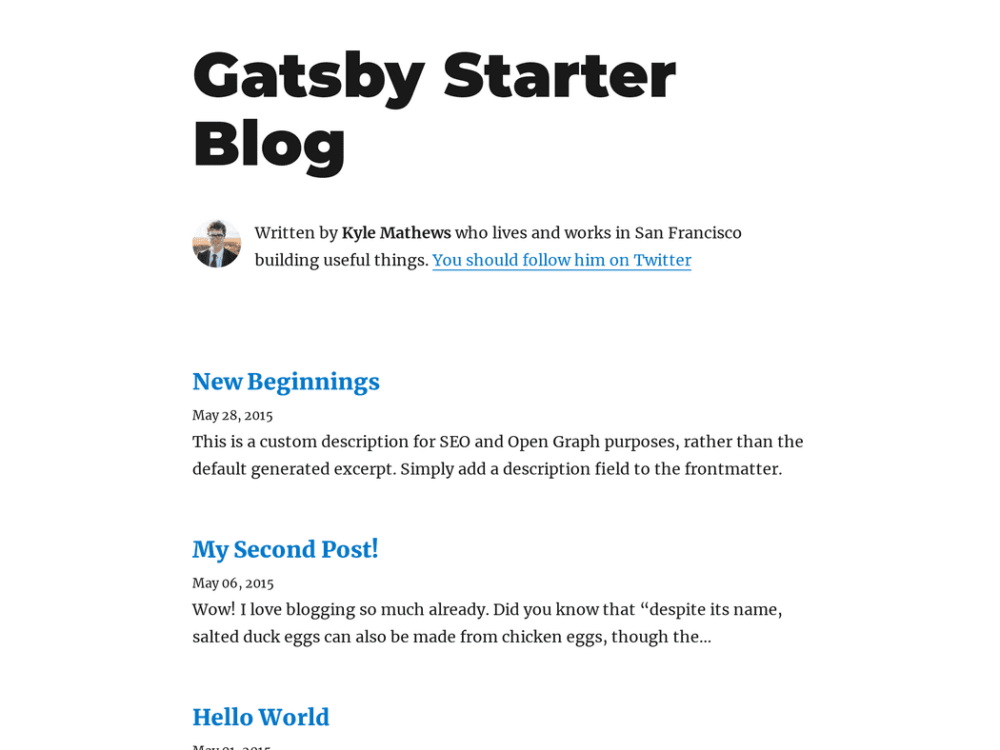

This is my first blog. In this blog, I'm going to show you, how I have created this blog site with comments. It's very simple. I have used gatsby and Github.

## Setup Development Environment

Before we start, we have to make sure that we have all the necessary packages installed in our system. To prepare your development environment, follow this guide provided on the gatsby website. Follow this guide up to the 'Create a gatsby site' section. 

[Setup Development Environment](https://www.gatsbyjs.com/docs/tutorial/part-zero/)

Now, you should have these packages installed in your system.
```
 1. node
 2. npm
 3. git
 4. gatsby-cli
```
## Generate gatsby site

Next, we will use a starter template for creating our blog site. I have chosen this one - [gatsby-starter-blog](https://www.gatsbyjs.com/starters/gatsbyjs/gatsby-starter-blog/).

Navigate to your desired directory and run the following command to create a clone of the starter template.

```
gatsby new my-blog https://github.com/gatsbyjs/gatsby-starter-blog
```

You can choose your preferred name for the project instead of 'my-blog'. Replace 'my-blog' in the command with your preferred name.

To build and run the project on your local server use this command

```
gatsby develop
```

If you visit the site, (http://localhost:8000/) it may look like this.



At this point, you may want to commit your changes.

## Personalize the blog site

Then, go to `gatsby-config.js` and replace the values of the siteMetadata according to your preference. Mine looks like this.

```
module.exports = {
  siteMetadata: {
    title: `My Blog`,
    author: {
      name: `Ershadul Hakim Rayhan`,
      summary: `A passionate problem solver`,
    },
    description: `A blog site built with gatsby`,
    siteUrl: `https://ershadul.me/my-blog`,
    social: {
      twitter: `ErshadulRayhan`,
    },
  },
  ...
```
Update the bio section by modifying the bio component.
Replace the profile-pic and Twitter links with yours.

## Add new blog posts

There are some example articles already added to this starter project. If you want to remove them, just remove them from the `content/blog` folder.

To add a new blog article, create a new folder inside `content/blog` and inside that folder add an `index.md` file. This `index.md` file will contain the content of your article. As this is a markdown blog, you can put your markdown document in this `index.md` file.

The format of the file should be like this

```
---
title: New Beginnings
date: "2015-05-28T22:40:32.169Z"
description: This is a custom description for SEO and Open Graph purposes, rather than the default generated excerpt. Simply add a description field to the frontmatter.
---

Far far away, behind the word mountains, far from the countries Vokalia and
Consonantia, there live the blind texts. Separated they live in Bookmarksgrove
...

```

So, we can see this file contains some metadata between those dashes. Remember to put them in your articles to show the title, date, and description.

At this point, you have built a fully working blog site. You can commit your changes and push them to Github.
I recommend hosting your blog on Github pages.

## Add comments to the blog (Optional)

I am using [utterances](https://utteranc.es/) for adding comments to my blog. Utterances uses Github issues to save comments. It's free and easy to use. To comment on posts the users have to log in using their Github and give utterances permission to their Github account.

Now, to add a comment section to your blog posts, follow the next steps.


To store the comments you need to create a public Github repo and give utterances app the permission for that Github repo. Visit [utterances](https://utteranc.es/) and read the instructions to create the script tag for the comment section.

I have created a repo for storing comments of my blog posts. The script tag looks like this

```
<script src="https://utteranc.es/client.js"
        repo="[ENTER REPO HERE]"
        issue-term="pathname"
        theme="github-light"
        crossorigin="anonymous"
        async>
</script>
```

Now, we have to implement this script in our blog app.

Go to `src/templates/blog-post.js`. 

We are going to use `useEffect` hook for adding the script. We want the script to load after our component did mount.

Let's import `useEffect` in the `blog-post.js`.


```
  import React, { useEffect } from "react"
```

Then inside the `BlogPostTemplate` function add this

```
useEffect(() => {
    const script = document.createElement('script');
    script.setAttribute("src", "https://utteranc.es/client.js");
    script.setAttribute("crossorigin","anonymous");
    script.setAttribute("async", true);
    script.setAttribute("repo", "github-username/repo-name");
    script.setAttribute("issue-term", "pathname");
    script.setAttribute( "theme", "github-light");

    document.body.appendChild(script);

  return () => {
    document.body.removeChild(script);
  }
  }, []);
```

Replace the attribute values according to your project. If you have done everything right, now you should see a comment box appearing on your blog.

**Congratulations!** You have successfully built a blog site with a comment section.


